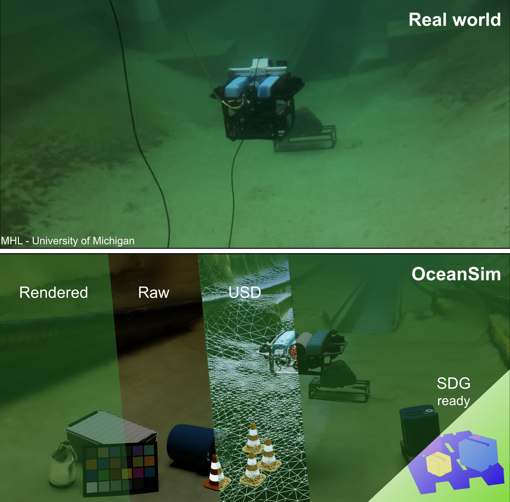

# OceanSim: A GPU-Accelerated Underwater Robot Perception Simulation Framework

<!-- website link to https://umfieldrobotics.github.io/OceanSim/ -->
<!-- arxiv https://arxiv.org/abs/2503.01074 -->
<!-- subscription form https://docs.google.com/forms/d/e/1FAIpQLSfKWMhE4L6R4jjvEw_bfMtLigXbv5WZeijDah5vk2SpQZW1hA/viewform -->
[](https://umfieldrobotics.github.io/OceanSim/)
[](https://docs.google.com/forms/d/e/1FAIpQLSfKWMhE4L6R4jjvEw_bfMtLigXbv5WZeijDah5vk2SpQZW1hA/viewform)
[](https://arxiv.org/abs/2503.01074)
[](https://docs.isaacsim.omniverse.nvidia.com/latest/index.html)
<!-- add and scale media/oceansim_demo.gif to full width-->
<!--  \ -->
<a href="https://umfieldrobotics.github.io/OceanSim/">
  
</a>

OceanSim is a high-fidelity underwater simulation framework designed to accelerate the development of robust underwater perception solutions. Leveraging GPU-accelerated rendering and advanced physics-based techniques, OceanSim accurately models both visual and acoustic sensors, significantly reducing the simulation-to-real gap.

## Highlights

<!-- GPU-accelerated, physics-based underwater sensor rendering, highly effetcive 3D workflows, open-source -->
<!-- use emoji -->
🚀 **GPU-accelerated**: OceanSim fully leverages the power of GPU-based parallel computing. OceanSim is built on top of [NVIDIA Isaac Sim](https://developer.nvidia.com/isaac/sim) and is part of [NVIDIA Omniverse](https://www.nvidia.com/en-us/omniverse/) ecosystem, which provide high performance and real-time rendering. \
🌊 **Physics-based underwater sensor rendering**: Experience realistic simulations with advanced physics models that accurately replicate underwater sensor data under varied conditions. \
🎨 **Efficient 3D workflows**: Users of OceanSim can enjoy efficient 3D workflows empowered by [OpenUSD](https://openusd.org/release/index.html). \
🤝 **Built by the community, for the community**: OceanSim is an open-source project and we invite the community to join us to keep improving it!
<!-- include figure media/oceansim_overall_framework.svg -->


## Latest Updates
- `[2025/4]` OceanSim is featured by [NVIDIA Robotics](https://www.linkedin.com/posts/nvidiarobotics_robotics-underwaterrobotics-simulation-activity-7313986055894880257-Dfmq?utm_source=share&utm_medium=member_desktop&rcm=ACoAACB8Y7sB7ikB6wVGPL5NrxYkNwk8RTEJ-3Y)!
- `[2025/4]` 🔥 Beta version of OceanSim is released!
- `[2025/3]` 🎉 OceanSim will be presented at [AQ²UASIM](https://sites.google.com/view/aq2uasim/home?authuser=0) and the late-breaking poster session at [ICRA 2025](https://2025.ieee-icra.org/)!
- `[2025/3]` OceanSim paper is available on arXiv. Check it out [here](https://arxiv.org/abs/2503.01074).

## TODO
- [x] Documentation for OceanSim provided example
- [x] Built your own digital twin documentation
- [x] Code release
- [ ] ROS bridge release

## Documentation
<!-- installation, running examples, building your own digital twins-->
We divide the documentation into three parts:
- [Installation](subsections/installation.md)
- [Running OceanSim](subsections/running_example.md)
- [Building Your Own Digital Twins with OceanSim](subsections/building_own_digital_twin.md)

## Support and Contributing
We welcome contributions and discussions from the community!
- Use [Discussions](https://github.com/umfieldrobotics/OceanSim/discussions) to share your ideas and discuss with other users.
- Report bugs or request features by opening an issue in [Issues](https://github.com/umfieldrobotics/OceanSim/issues).
- Submit a pull request if you want to contribute to the codebase. Please include the description of your changes and the motivation behind them in the pull request. You can check more details in [CONTRIBUTING.md](./subsections/contribution_guide.md).

## Contributors
OceanSim is an open-source project initiated by the [Field Robotics Group](https://fieldrobotics.engin.umich.edu/) (FRoG) at the University of Michigan. We hope to build a vibrant community around OceanSim and invite contributions from researchers and developers around the world! A big shoutout to our contributors:

[Jingyu Song](https://song-jingyu.github.io/), [Haoyu Ma](https://haoyuma2002814.github.io/), [Onur Bagoren](https://www.obagoren.com/), [Advaith V. Sethuraman](https://www.advaiths.com/), [Yiting Zhang](https://sites.google.com/umich.edu/yitingzhang/), and [Katherine A. Skinner](https://fieldrobotics.engin.umich.edu/).
<!-- - [Jingyu Song](https://song-jingyu.github.io/)  
- [Haoyu Ma](https://haoyuma2002814.github.io/)  
- [Onur Bagoren](https://www.obagoren.com/)  
- [Advaith V. Sethuraman](https://www.advaiths.com/)  
- [Yiting Zhang](https://sites.google.com/umich.edu/yitingzhang/)  
- [Katherine A. Skinner](https://fieldrobotics.engin.umich.edu/) -->


## Citation
If you find OceanSim useful for your research, we would appreciate that you cite our paper:
```
@misc{song2025oceansim,
      title={OceanSim: A GPU-Accelerated Underwater Robot Perception Simulation Framework}, 
      author={Jingyu Song and Haoyu Ma and Onur Bagoren and Advaith V. Sethuraman and Yiting Zhang and Katherine A. Skinner},
      year={2025},
      eprint={2503.01074},
      archivePrefix={arXiv},
      primaryClass={cs.RO},
      url={https://arxiv.org/abs/2503.01074}, 
}
```
If you use the sonar model in OceanSim, please also cite the HoloOcean paper as the HoloOcean sonar model inspires our sonar model implementation:
```
@inproceedings{Potokar22iros,
  author = {E. Potokar and K. Lay and K. Norman and D. Benham and T. Neilsen and M. Kaess and J. Mangelson},
  title = {Holo{O}cean: Realistic Sonar Simulation},
  booktitle = {Proc. IEEE/RSJ Intl. Conf. Intelligent Robots and Systems, IROS},
  address = {Kyoto, Japan},
  month = {Oct},
  year = {2022}
}
```

---

*OceanSim - A GPU-Accelerated Underwater Robot Perception Simulation Framework*

